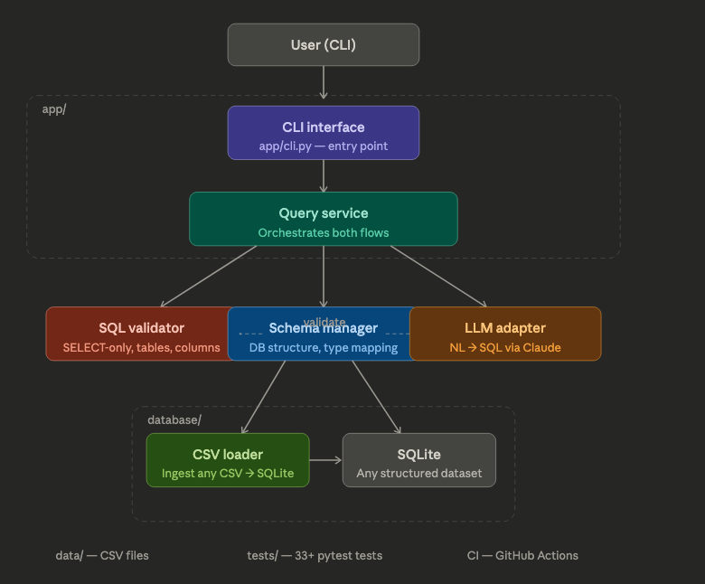
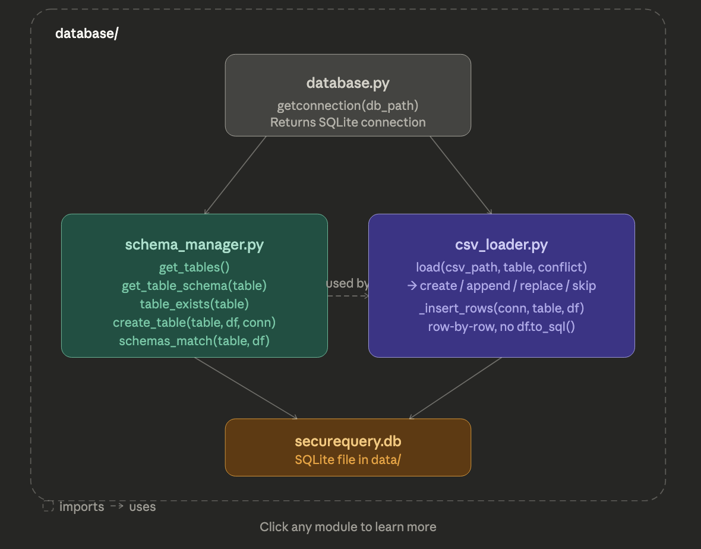
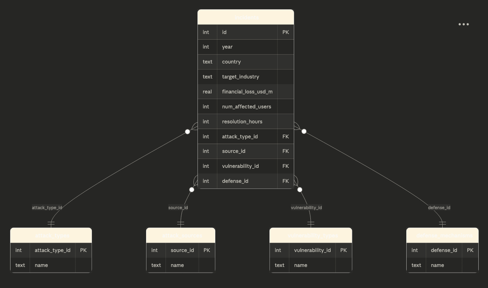

# SecureQuery
SecureQuery is a modular system that allows users to query cybersecuity data using natural language. 

The goal of the project is to translate user input into SQL using an LLM, validate the query for safety, and execute it on SQLite database.

The system is designed with a strong focus on security, ensuring that only safe, read-only queries are allowed while preventing harmful operations such as data modification or deletion. 

## CURRENT PROGRESS
Right now, the **database layer is implemented**. This includes:

- CSV data ingestion into SQLite
- Automatic table creation from CSV files
- Schema validation before inserting data
- Conflict handling (append, replace, skip)
- Clean database connection management

The natural language and SQL validation components are still in progress.

---

## Features

## Implemented 
- Modular architecture for scalability 
- CSV data ingestion into SQLite 
- Modular architecture

## In Progress
- Natural language to SQL translation usng LLMs 
- Secure SQL validation (SELECT-only queries)
- Query execution service
- CLI-based interface for easy interaction 

## Architecture

The system is composed of several key components:

- **CLI Interface** – Entry point for user input
- **Query Service** – Orchestrates the query workflow
- **LLM Adapter** – Converts natural language into SQL
- **SQL Validator** – Ensures queries are safe to execute
- **Schema Manager** – Maintains database structure information
- **CSV Loader** – Loads raw data into SQLite
- **SQLite Database** – Stores cybersecurity logs

---

## Database Module (What's working Now)

### `database.py`
- Handles SQLite connections
- Provides `getconnection()` helper

### `schema_manager.py`
- checks if tables exist
- Compares schemas 
- Creates tables from CSV data

### `csv_loader.py`
- Loads CSV diles into SQLite 
- Handles conflicts:
    - `append`
    - `replace`
    - `skip`
- Inserts rows manually (no `df.to_sql()`)

## Database Schema
The database is structured using a normalized schema centered around cybersecuirty incidents. 

Each incident reference multiple lookup tables to reduce redundancy and improve query efficiency.

## Main Table: `incidents`
- `id` (PK)
- `year`
- `country`
- `target_industry`
- `financial_loss_usd_m`
- `num_affected_users`
- `resolution_hours`
- `attack_type_id` (FK)
- `source_id` (FK)
- `vulerability_id` (FK)
- `defense_id` (FK)

### Lookup Tables

#### `attack_types`
- `attack_type_id` (PK)
- `name`

#### `attack_sources`
- `source_id` (PK)
- `name`

#### `vulnerability_types`
- `vulnerability_id` (PK)
- `name`

#### `defense_mechanisms`
- `defense_id` (PK)
- `name`

---

### Relationships

- Each **incident** is linked to:
  - one attack type
  - one attack source
  - one vulnerability type
  - one defense mechanism

This design reduce duplication and allows more efficient querying and filtering across categories 

---

## Dataset 
Global Cybersecuity Threats (2015-2024)

